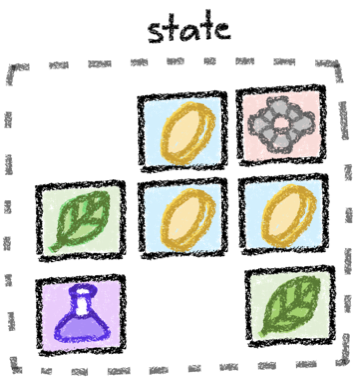
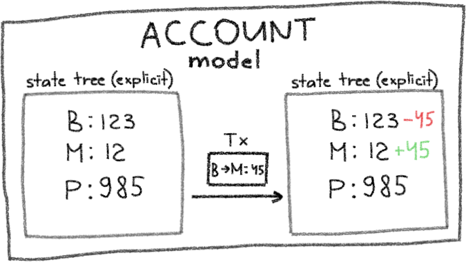
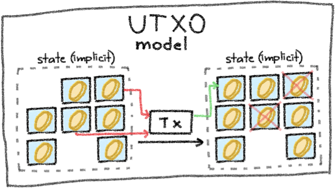
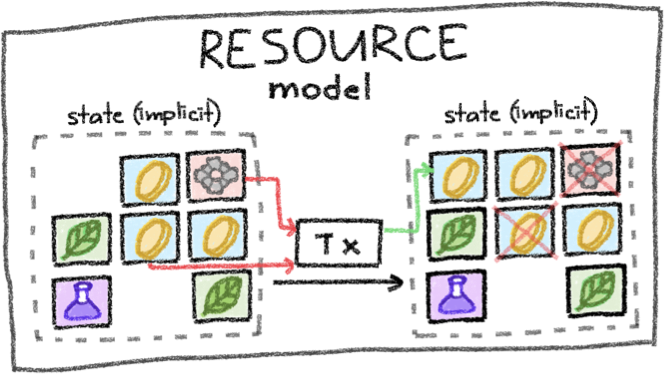
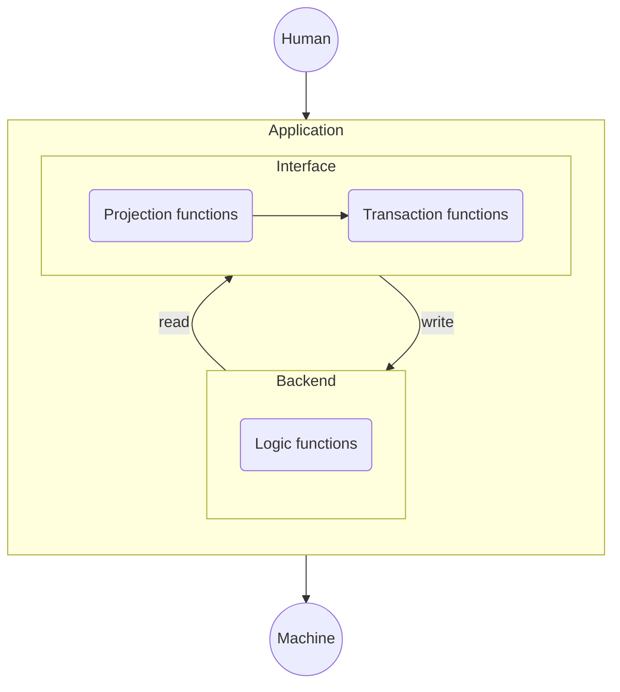

# Anoma Applications Primer

Anoma is a distributed operating system for intent-centric applications.

In the beginning, we introduce some of Anoma's mechanisms with a focus on app-development.

- [Anoma's State Model](#anomas-state-model)
- [Resources](#resources)
- [Transactions](#transactions)
- [Anoma Resource Machine](#anoma-resource-machine)
  - [Concepts](#concepts)
  - [Valididty](#validity)
- [Applications](#applications)

## Anoma's State Model

Anoma organizes state in a resource model.

<p align="center">

</p>
<p align="right">
<small>
Credit to Yulia Khalniyazova for all graphics in this document.
</small>
</p>

<details><summary><b>Comparison to other State Models</b></summary>

Comparing the resource model to other state models, the advantages become clear.

#### Account Model

<p align="center">

</p>

- State is explict and global
- Example: An Ethereum smart contract containing value (e.g., `uint256 count`) or a account balance mapping (`mapping(address => uint256) balanceOf`).
- An application must be deployed to each chain specifically.
- Cross-chain apps require sophisticated bridging and code changes.

#### UTXO Model

<p align="center">

</p>

- State is implicit and comprised of all unspent transaction outputs (UTXOs)
- Examples: Bitcoin or Zcash transactions
- The predicate determining if it is allowed to spent an UTXO is always the same
- Arbitrary applications are difficult/not possible

#### Resource Model

<p align="center">

</p>

- State is implicit and comprised of all unspent resources
- Predicates and data attached to resources can be arbitrary
- Arbitrary applications and general intents are enabled

</details>

### Affordances

This enables[^cwgoes]

[^cwgoes]: https://ethresear.ch/t/rfc-draft-anoma-as-the-universal-intent-machine-for-ethereum/19109.

- Heterogeneous trust
  - Resources can live on different controllers (e.g., L1's, L2's, three friends in a LAN).
  - A transaction can consume a resource on controller A and create it on controller B.
- Information flow control
  - Transactions can be sent transparent, shielded, or private just by setting a flag
- Intent-level Composability
  - Intents (unbalanced transactions) can be composed and settled across different applications and chains

## Resources

**Resources** are atomic units of application state and logic. They have

- a quantity, label, and specific kind
- data (e.g, owner, diameter, etc.)
  | 5 🐚 `{diameter : 1.4}` | 2 🍏 `{fruitiness : 8 / 10}` | 1 💌 `{text : "I ❤️ u"}` |
  |:--------------------------------:|:-----------------------------:|:---------------------------------:|
  | `5 Shell` resource | `2 GreenApple` resource | `1 Message` Resource |
- a lifecycle with three stages,
  ```mermaid
  flowchart LR
    Non-existent --> Created --> Consumed
  ```
- a logic function enforcing predicates (that check data, e.g., in itself, the transaction or other resources)

<details><summary><b>The <code>Resource</code> object in detail</b></summary>

```haskell
type Resource :=
  mkResource@{
    logic : LogicRef;
    label : LabelRef;
    value : ValueRef;
    quantity : Quantity;
    ephemeral : Bool;
    nonce : Nonce;
    randSeed : RandSeed;
    nullifierKeyCommitment : NullifierKeyCommitment;
  };
```

- **`logic`:** A boolean-valued function enforcing predicates required to create and consume the resource.
- **`label`:** Arbitrary data describing the resource and determining its kind (e.g., the name or symbol).
- **`value`:** Arbitrary data associated with the resource (e.g., the owner).
- **`quantity`:** The number of units that this resource describes.
- **`ephemeral`** A boolean expressing whether this resource is ephemeral or not, i.e., exists only during a transaction.
- **`nonce`:** A number ensuring the uniqueness of the resource.
- **`randSeed:`** A number to derive (pseudo)-randomness from.
- **`nullifierKeyCommitment`** A commitment to a secret nullfier key.

*Types named `*Ref` are binding references to objects in BLOB storage.

</details>
<p></p>

**Creation:** To create a resource its _commitment_ must be computed by hashing the resource object.
$$\texttt{commitment} := h_\texttt{cm}(\texttt{resource})$$
After execution, the commitment is added to a Merkle tree.

**Consumption:** To consume a resource its _nullifier_ must be computed by hashing the resource object and a secret called the _nullifier key_.
$$\texttt{nullifier} := h_\texttt{nf}(\texttt{resource},\,\texttt{nullifierKey})$$
After execution, the nullifier is added into a nullifier set.

**Kind:** The _kind_ of a resource determines its fungibility and is computed as the hash of its _logic_ and _label_.
$$\texttt{kind} := h_\texttt{kind}(\texttt{logic},\,\texttt{label})$$
The kind is used to check if transactions are balanced.

## Transactions

**Transactions** consume and create resources.

- Transactions with equal quantities of created and consumed resources of the same kind are **balanced**.
- If all resource logics are

- An unbalanced transaction is called **intent**.
- Only balanced and transactions can be executed

  |       Consumed        |        Created        | Balanced? ✅/❌ |
  | :-------------------: | :-------------------: | :-------------: |
  |          2🍏          |          2🍏          |                 |
  |          2🍏          |       1🍏 + 1🍏       |                 |
  |       2🍏 + 1🐚       |       1🍏 + 2🐚       |                 |
  |       2🍏 + 1🐚       |    1🍏 + 1🍎 + 1🐚    |                 |
  | 1🍏 + 2🍎 + 2🍎 + 3🐚 | 1🍏 + 4🍎 + 1🐚 + 2🐚 |                 |

- contain **actions** for context separation.

<details><summary> <b>The <code>Transaction</code> object</b></summary>

```haskell
type Transaction :=
  mkTransaction@{
    actions : Set Action;
    roots : Set CommitmentTree.Root;
    delta : Delta;
    deltaProof : Delta.Proof;
  };

- **`actions`:** Contains
- **`roots`:** Computed for each consumed resource.
- **`delta`:** Computed for each consumed resource.
- **`deltaProof`:** Computed for each consumed resource.

type Action :=
  mkAction@{
    commitments : Set Commitment;
    nullifiers : Set Nullifier;
    proofs : Set Proofs;
    appData : AppData;
  };
```

- **`commitments`:** Computed for each created resource.
- **`nullifiers`:** Computed for each consumed resource.
- **`proof`:** Logic and compliance proofs
- **`appData`:** A mapping containing arbitrary, application-specific data.
</details>

## Anoma Resource Machine

The [**Anoma Resource Machine** (ARM)](#resource-machine) is a virtual machine being part of the Anoma Protocol and checks if transactions are adhering to its rules and are therefore [valid](#validity).

### Validity

1. **Balance check:** The number of consumed and created resources of the same kind must balance in a transaction.
2. **Resource Logic Checks:** For each resource in the transaction, the corresponding resource logic function must return `true`.
3. **Compliance Checks:** Ensures the RM rules are met.
   - Created resources
     - Commitments can not exist already.
   - Consumed resources
     - Commitment must exist already
     - Nullifier can not exist
   - Ephemeral resources (created and consumed)
     - existence checks are skipped

## Applications

Applications consist of application state and logic.

- State is modelled as resources and the data they contain
- Logic is modelled as resource logic functions expressing the predicates required for a resource to be created and consumed

Accordingly, resources and corresponding **resource logic functions** constitute the **application backend**.

Instead of creating and consuming resources and providing all data required in the transaction object directly and manually, users interact with an **application interface**.

<details><summary><b>Interface details</b></summary>

The interface consists of

- Projection functions (the application **read interface**)
  - Outputs meaningful data projected from the state
  - Example: The total quantity of resources of specific kind owned by an identity
- Transaction function (the application **write interface**)
  - Outputs a transaction object
  - Example: Transfer of a resource to a new owner.




</details>
